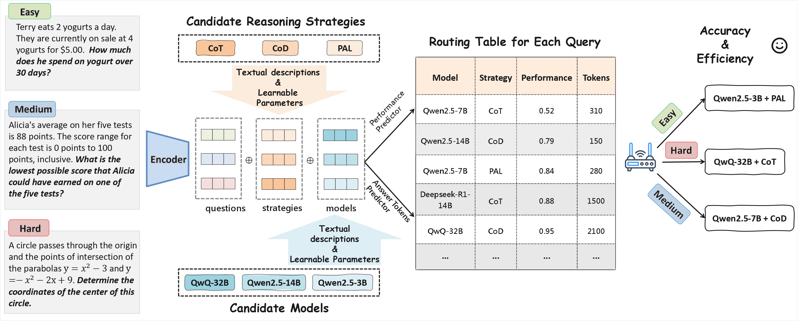

# RTR: Route to Reason

This repository contains the codebase for the paper **\[Route to Reason: Adaptive Routing for LLM and Reasoning Strategy Selection]**.


---

## 🔧 Setup

1. Clone this repository:

   ```bash
   git clone <repo_url>
   cd rtr_test
   ```

2. Create and activate the conda environment:

   ```bash
   conda create -n rtr python=3.10
   conda activate rtr
   pip install -r requirements.txt
   ```

---

## 📊 Data

We use open-source math evaluation frameworks [Qwen-math-evaluation](https://github.com/QwenLM/Qwen2.5-Math) and [vLLM](https://github.com/vllm-project/vllm) to generate our dataset. The original dataset will be publicly released after the paper is accepted.

---

## 🚀 Run Instructions

### 1. Generate Embeddings

Generate embeddings for models, strategies, and questions:

```bash
cd data
python ./data/gen_model_strategy_emb.py --encoder_model_path <path_to_encoder_model>
python ./data/gen_question_emb.py --encoder_model_path <path_to_encoder_model>
```

* `--encoder_model_path`: Path to your sentence-transformer model used to encode questions, models, and strategies.

---

### 2. Training and Prediction

Train the model and run prediction:

```bash
python ./src/main.py
```

#### Arguments:
* `--epochs`: Number of training epochs (default: 100)
* `--batch_size`: Training batch size (default: 256)
* `--lr`: Learning rate (default: 1e-3)
* `--cls_hidden_dim`: Hidden layer dimension for the classifier (default: 768)
* `--reg_hidden_dim`: Hidden layer dimension for the regressor (default: 768)
* `--save_cls_path`: Path to save the best classifier model (default: `./data/best_model_cls_encoder_embedding.pth`)
* `--save_reg_path`: Path to save the best regressor model (default: `./data/best_model_reg_encoder_embedding.pth`)
* `--patience`: Patience for early stopping (default: 5)
* `--encoder_model_path`: Path to the sentence encoder model (default: `""`)
* `--predict`: Whether to run prediction after training (default: False)


